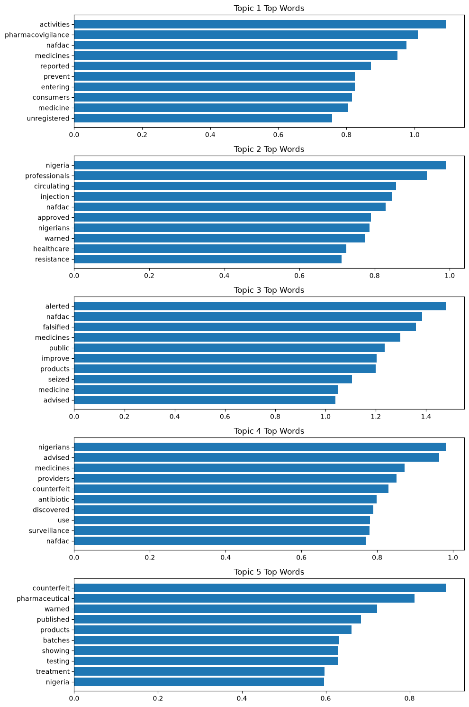
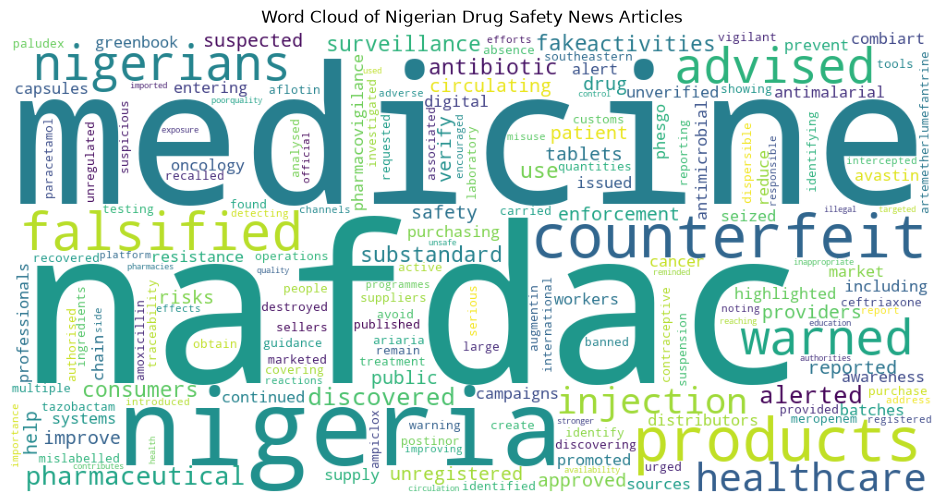
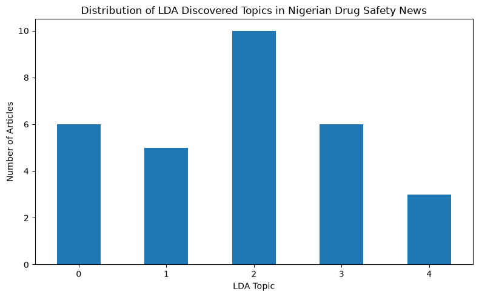
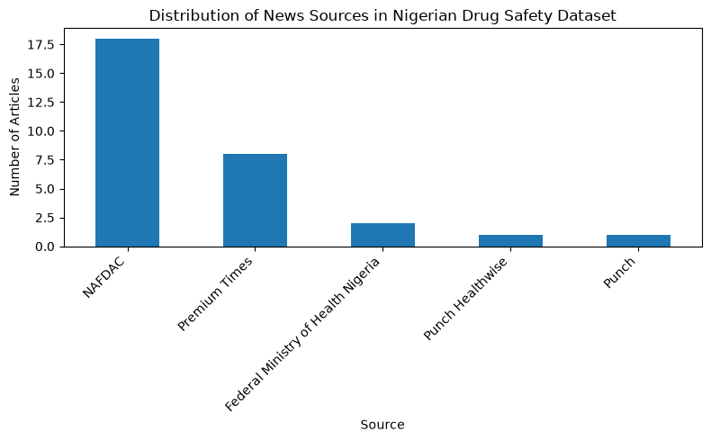

# Nigerian Drug Safety News Intelligence Using NLP
https://chizix-drug-safety-intelligence.streamlit.app/
## Project Overview

This project applies Natural Language Processing (NLP) techniques to analyze Nigerian drug safety news articles, identify major themes, and uncover hidden patterns related to counterfeit medicines, medicine safety, regulatory enforcement, and pharmacovigilance.

Using text preprocessing, TF-IDF feature extraction, and Latent Dirichlet Allocation (LDA) topic modelling, the project provides insights into pharmaceutical safety concerns in Nigeria.

---

## Problem Statement

Counterfeit and substandard medicines remain a major public health concern. This project explores how NLP can be used to analyze drug safety information from Nigerian news sources and identify recurring safety themes.

---

## Objectives

The objectives of this project are to:

- Analyze Nigerian drug safety news articles using NLP techniques.
- Identify major themes and patterns in medicine safety reporting.
- Discover hidden topics using LDA topic modelling.
- Visualize important trends within the dataset.

---

## Dataset

The dataset contains:

- 30 Nigerian drug safety news articles
- Sources included NAFDAC, Premium Times, Punch, and Federal Ministry of Health Nigeria

Dataset features:

- Title
- Source
- Date
- Article text
- URL
- Topic category

---

## Methodology

The project workflow includes:

1. Data collection
2. Data cleaning and preprocessing
3. Exploratory Data Analysis (EDA)
4. Text preprocessing
5. TF-IDF feature extraction
6. LDA topic modelling
7. Data visualization and interpretation

---

## Tools and Technologies

- Python
- Pandas
- Matplotlib
- Scikit-learn
- WordCloud
- Natural Language Processing (NLP)
- Latent Dirichlet Allocation (LDA)

---

## Key Findings

The analysis identified major themes including:

- Counterfeit medicines
- Medicine safety alerts
- Drug regulation
- Pharmacovigilance
- Antimicrobial resistance
- Digital drug safety

The most frequently represented source in the dataset was NAFDAC, reflecting its major role in medicine regulation and public safety alerts.

---

## Results and Visualizations

The project generated:

- Source distribution analysis
- Drug safety topic distribution
- Word Cloud visualization
- LDA topic discovery plots
- Topic keyword analysis

---

## Visualizations

### Distribution of Drug Safety Topics in Nigerian News Dataset

### Word Frequency Analysis Using Word Cloud

### LDA Topic Modelling Results

### Distribution of News Sources in Dataset

---

## Conclusion

This project demonstrates how Natural Language Processing can support pharmaceutical safety analysis by identifying trends, themes, and emerging concerns within Nigerian drug safety information.

The findings highlight the potential of AI-driven text analytics for public health monitoring and decision support.
